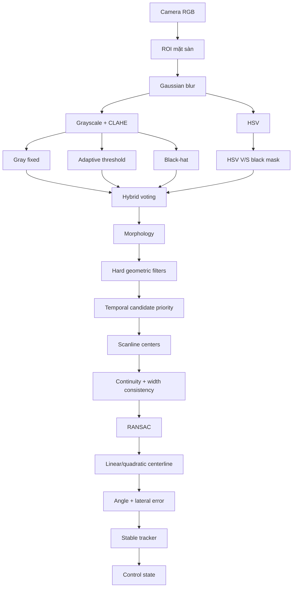

# Black Line Vision V3

Hệ thống nhận diện băng keo đen trên nền sáng dành cho prototype dò line của Unitree G1.

Phiên bản V3 bổ sung:

- chế độ hiệu chỉnh trực tiếp bằng trackbar;
- bốn chế độ tách line: grayscale cố định, adaptive grayscale, HSV black và hybrid;
- không dùng Hue để nhận màu đen;
- lưu tham số đã chỉnh vào YAML;
- tự động nạp lại tham số khi chạy;
- lọc nhiễu cứng theo độ dài, vị trí, độ tương phản và độ liên tục;
- dashboard hiển thị góc, sai lệch ngang, confidence và lệnh điều khiển.

## Chạy nhanh

### 1. Cài đặt

```powershell
python -m venv .venv
.venv\Scripts\activate
python -m pip install --upgrade pip
pip install -r requirements.txt
```

Hoặc:

```powershell
.\setup_windows.bat
```

### 2. Hiệu chỉnh camera

Camera số 1:

```powershell
python calibrate_parameters.py --source 1 --profile balanced
```

Hoặc chạy:

```text
run_calibration_camera_1.bat
```

Khi mask đã đúng, nhấn `S` để lưu:

```text
calibration/tuned_parameters.yaml
```

### 3. Chạy detector với tham số đã lưu

```powershell
python app.py --source 1 --profile balanced
```

Hoặc:

```text
run_camera_1_tuned.bat
```

Ứng dụng tự tìm và nạp `calibration/tuned_parameters.yaml`.

## Tài liệu chi tiết

Đọc:

```text
HUONG_DAN_SU_DUNG_CHI_TIET.md
```

## Kiến trúc xử lý



## Phím trong cửa sổ calibration

| Phím | Chức năng |
|---|---|
| `S` | Lưu tuning YAML và ảnh preview |
| `P` | Pause/unpause |
| `R` | Reset temporal tracker |
| `Q` hoặc `Esc` | Thoát |

## Phím trong cửa sổ chạy chính

| Phím | Chức năng |
|---|---|
| `1` | Sensitive |
| `2` | Balanced |
| `3` | Strict |
| `M` | Bật/tắt mask overlay |
| `D` | Bật/tắt điểm debug |
| `T` | Bật/tắt mask panel |
| `R` | Reset tracker |
| `S` | Lưu dashboard và JSON |
| `P` | Pause |
| `Q` hoặc `Esc` | Thoát |

## Kiểm thử ảnh mẫu

```powershell
python tools\generate_test_images.py
python app.py --source samples\line_center.jpg --image --profile balanced --no-tuning
```

Chạy smoke test:

```powershell
python tests\smoke_test.py
```

## Lưu ý an toàn

Các giá trị `yaw_command`, `lateral_command` và `forward_command` hiện chỉ là đầu ra giả lập. Chưa gửi trực tiếp sang Unitree G1.

Trước khi điều khiển robot thật cần bổ sung:

- emergency stop;
- watchdog;
- giới hạn vận tốc;
- kiểm tra thăng bằng;
- phát hiện vật cản;
- hiệu chuẩn camera–robot;
- kiểm thử ở tốc độ thấp.

## Cập nhật V3.1: nhận line nằm ngang

Phiên bản V3.1 sửa trường hợp băng keo nằm ngang hoàn toàn trong ảnh.

Nguyên nhân ở phiên bản cũ:

- candidate bắt buộc phải chiếm nhiều chiều cao ROI;
- thuật toán chỉ lấy tâm theo các dải ngang nên line ngang có quá ít điểm;
- góc lớn hơn `82°` bị loại.

Cách xử lý mới:

1. Candidate được đánh giá theo **trục dài nhất**, không chỉ chiều dọc.
2. Line dọc hoặc nghiêng tiếp tục dùng scanline + RANSAC.
3. Line gần ngang tự động chuyển sang **contour PCA fallback**.
4. Góc hợp lệ được mở đến `±90°`.
5. Giao diện calibration và giao diện chạy chỉ giữ camera + selected line.

### Quy ước góc

```text
0°       = line hướng thẳng từ dưới lên trên ảnh
+90°     = line nằm ngang theo một chiều
-90°     = line nằm ngang theo chiều tương đương còn lại
```

Line là một đường không có chiều nên `0°` và `180°` mô tả cùng một phương. Hệ thống chuẩn hóa về `[-90°, +90°]` để thuận tiện tạo lệnh quay.

### Không cần chỉnh trackbar để nhận line ngang

Sửa lỗi này nằm trong thuật toán, không phải chỉ ở threshold. Tuning cũ vẫn có thể dùng lại. Khi mở tuning cũ, kiểm tra:

```yaml
line_model:
  max_abs_angle_deg: 90.0
```

Nếu file tuning cũ không chứa tham số này thì hệ thống sẽ lấy giá trị `90.0` từ `config.yaml`.

## Upload GitHub tự động

Project có sẵn script PowerShell để tạo repository và push lên tài khoản `Qtryn`:

```powershell
.\publish_to_github.ps1
```

Repository mặc định:

```text
Qtryn/unitree-g1-black-line-vision
```

Tạo private repository:

```powershell
.\publish_to_github.ps1 -Visibility private
```

Đổi tên repository:

```powershell
.\publish_to_github.ps1 -Repo ten-repository-moi
```

Script sẽ kiểm tra `git`, GitHub CLI, tài khoản đang đăng nhập, `.gitignore`, commit và push.
