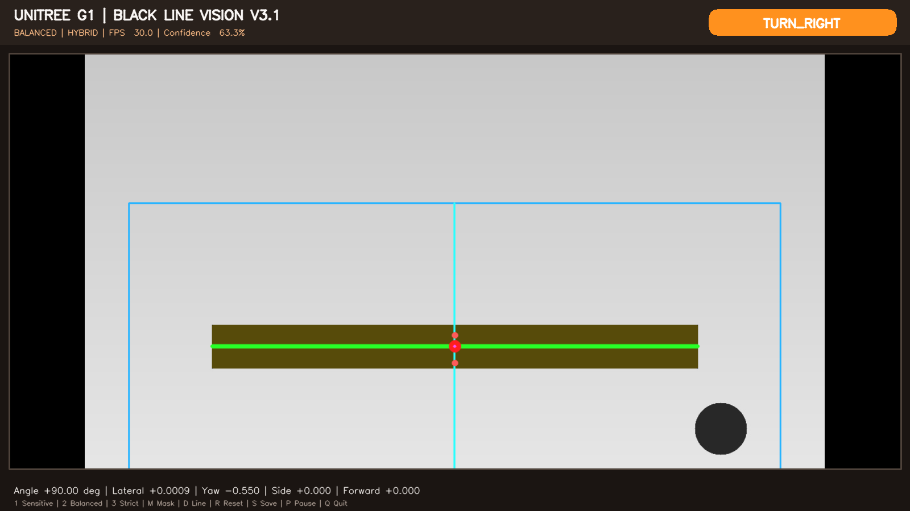
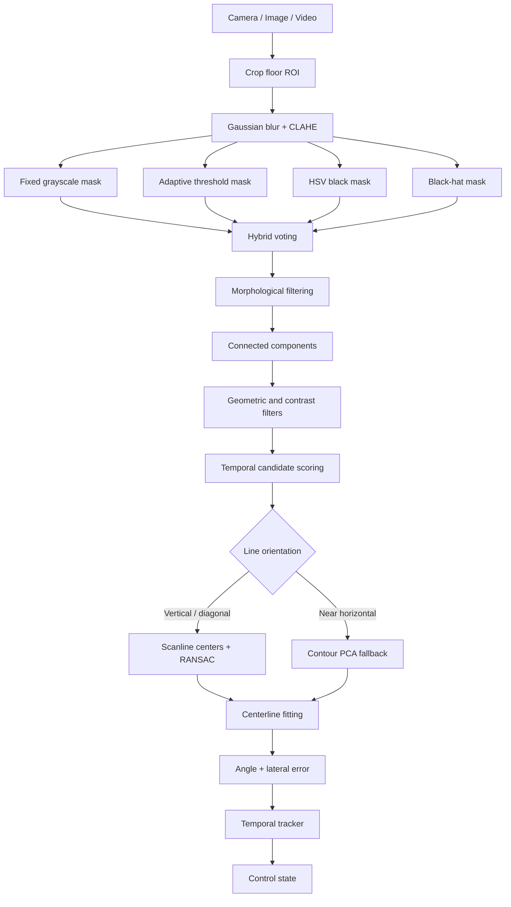

# Unitree G1 Black Line Vision

> Hệ thống thị giác máy tính nhận diện và ước lượng hướng của băng keo đen trên nền sáng, phục vụ nghiên cứu dò line và chuẩn bị tích hợp với robot Unitree G1.


<p align="center">
  
</p>

## Tổng quan

Project xây dựng một pipeline thị giác thời gian thực để:

* phát hiện băng keo đen trên mặt sàn sáng;
* xác định line nằm bên trái, bên phải hay chính giữa camera;
* ước lượng góc line so với hướng nhìn của camera;
* hỗ trợ cả line dọc, line nghiêng và line nằm ngang hoàn toàn;
* sinh đầu ra điều khiển mức cao như `TURN_LEFT`, `TURN_RIGHT`, `MOVE_LEFT`, `MOVE_RIGHT`, `FORWARD`, `LINE_LOST` và `LINE_END`;
* hiệu chỉnh trực tiếp bằng trackbar và lưu tham số vào YAML;
* chạy với ảnh, video hoặc camera RGB thông thường trước khi tích hợp lên Unitree G1.

> [!IMPORTANT]
> Project hiện là **prototype thị giác và sinh lệnh giả lập**. Các giá trị `yaw_command`, `lateral_command` và `forward_command` chưa được gửi trực tiếp tới robot.

## Điểm nổi bật

### Hybrid black-line detection

Màu đen được nhận diện chủ yếu theo độ sáng thấp, không phụ thuộc vào Hue. Pipeline có thể kết hợp:

* fixed grayscale threshold;
* adaptive grayscale threshold;
* HSV `V/S` black mask;
* Otsu threshold tùy chọn;
* black-hat morphology;
* very-dark pixel rescue;
* voting giữa nhiều mask.

### Lọc nhiễu theo hình học

Candidate không chỉ được đánh giá theo màu mà còn theo:

* diện tích;
* độ dài so với độ rộng;
* độ đặc của contour;
* độ tương phản cục bộ;
* độ liên tục qua các lát cắt;
* độ ổn định chiều rộng;
* vị trí so với đáy ROI;
* độ gần với line ở frame trước.

### Theo dõi ổn định theo thời gian

* Exponential Moving Average cho góc, sai lệch ngang và confidence;
* giữ kết quả ngắn hạn khi line mất trong vài frame;
* hạn chế nhảy sang vùng nhiễu khác;
* phát hiện trạng thái mất line và cuối line.

### Hỗ trợ line nằm ngang

Từ phiên bản V3.1, hệ thống sử dụng hai nhánh ước lượng hình học:

* line dọc hoặc nghiêng: scanline centers + RANSAC + polynomial fitting;
* line gần ngang: contour PCA fallback.

Nhờ đó line nằm ngang hoàn toàn không còn bị loại bởi điều kiện vertical span hoặc thiếu scanline points.

## Kiến trúc xử lý



## Đầu ra chính

Khi nhấn `S`, ứng dụng lưu ảnh kết quả và file JSON trong thư mục `outputs/`.

Ví dụ:

```json
{
  "profile": "balanced",
  "detection_mode": "hybrid",
  "tuning_loaded": true,
  "state": "TURN_RIGHT",
  "line_detected": true,
  "line_end_detected": false,
  "confidence": 0.91,
  "angle_deg": 18.4,
  "lateral_error_norm": 0.13,
  "yaw_command": -0.40,
  "lateral_command": -0.11,
  "forward_command": 0.0,
  "visible_length_px": 438.2,
  "forward_distance_cm": null,
  "candidate_count": 1
}
```

| Trường                | Ý nghĩa                                                         |
| --------------------- | --------------------------------------------------------------- |
| `state`               | Trạng thái điều khiển mức cao                                   |
| `line_detected`       | Line có được phát hiện ở frame hiện tại hay không               |
| `confidence`          | Độ tin cậy sau lọc và fitting                                   |
| `angle_deg`           | Góc line so với hướng thẳng của camera                          |
| `lateral_error_norm`  | Sai lệch ngang chuẩn hóa, gần trong khoảng `[-1, 1]`            |
| `yaw_command`         | Lệnh quay giả lập                                               |
| `lateral_command`     | Lệnh dịch ngang giả lập                                         |
| `forward_command`     | Lệnh tiến giả lập                                               |
| `line_end_detected`   | Trạng thái kết thúc line                                        |
| `forward_distance_cm` | Khoảng cách ước lượng sau khi hiệu chuẩn bird's-eye và pixel/cm |

## Quy ước góc

```text
  0°   : line hướng thẳng từ dưới lên trên ảnh
 +90°  : line nằm ngang theo một chiều chuẩn hóa
 -90°  : line nằm ngang theo chiều chuẩn hóa còn lại
```

Line là một đường không có chiều, nên `0°` và `180°` mô tả cùng một phương. Project chuẩn hóa góc về `[-90°, +90°]` để thuận tiện cho điều khiển.

## Cấu trúc project

```text
unitree-g1-black-line-vision/
├── app.py                         # Chạy nhận diện ảnh, video hoặc camera
├── calibrate_parameters.py        # Giao diện trackbar hiệu chỉnh detector
├── calibrate_birdseye.py          # Hiệu chuẩn phối cảnh mặt sàn
├── vision.py                      # Segmentation, candidate filtering, line fitting
├── tracker.py                     # Làm mượt và giữ trạng thái theo thời gian
├── controller.py                  # Chuyển sai lệch thành state/command giả lập
├── ui.py                          # Giao diện camera + selected line
├── models.py                      # Dataclass dùng chung
├── tuning.py                      # Đọc, ghi và merge tuning YAML
├── config.yaml                    # Cấu hình mặc định
├── requirements.txt
├── calibration/
│   └── tuned_parameters.example.yaml
├── samples/                       # Ảnh kiểm thử mẫu
├── tests/
│   └── smoke_test.py
├── tools/
│   └── generate_test_images.py
├── docs/
│   └── preview.png
├── HUONG_DAN_SU_DUNG_CHI_TIET.md
└── setup_windows.bat
```

## Yêu cầu

* Python;
* OpenCV;
* NumPy;
* PyYAML;
* camera RGB hoặc file ảnh/video.

Khuyến nghị dùng Python 3.10–3.12 để hạn chế vấn đề tương thích package trên Windows.

## Cài đặt

### Windows — cách nhanh

```powershell
.\setup_windows.bat
```

### Windows — cài thủ công

```powershell
python -m venv .venv
.venv\Scripts\activate
python -m pip install --upgrade pip
pip install -r requirements.txt
```

### Linux hoặc macOS

```bash
python3 -m venv .venv
source .venv/bin/activate
python -m pip install --upgrade pip
pip install -r requirements.txt
```

## Chạy nhanh

### 1. Clone repository

```bash
git clone https://github.com/Qtryn/unitree-g1-black-line-vision.git
cd unitree-g1-black-line-vision
```

### 2. Test bằng ảnh mẫu

```powershell
python app.py --source samples\line_center.jpg --image --profile balanced --no-tuning
```

Test line nằm ngang:

```powershell
python app.py --source samples\line_horizontal.jpg --image --profile balanced --no-tuning
```

### 3. Chạy webcam

Camera số 0:

```powershell
python app.py --source 0 --profile balanced
```

Camera số 1:

```powershell
python app.py --source 1 --profile balanced
```

### 4. Chạy video

```powershell
python app.py --source path\to\video.mp4 --profile balanced
```

### 5. Chạy với tuning cụ thể

```powershell
python app.py ^
  --source 1 ^
  --profile balanced ^
  --tuning calibration\tuned_parameters.yaml
```

### 6. Bỏ qua tuning đã lưu

```powershell
python app.py --source 1 --profile balanced --no-tuning
```

## Hiệu chỉnh detector

Chạy giao diện calibration:

```powershell
python calibrate_parameters.py --source 1 --profile balanced
```

Nạp tuning cũ trước khi chỉnh tiếp:

```powershell
python calibrate_parameters.py ^
  --source 1 ^
  --profile balanced ^
  --load-existing
```

Lưu sang file khác:

```powershell
python calibrate_parameters.py ^
  --source 1 ^
  --profile balanced ^
  --output calibration\floor_lab.yaml
```

### Detection modes

| Giá trị | Chế độ       | Mục đích                                |
| ------: | ------------ | --------------------------------------- |
|     `0` | `gray_fixed` | Môi trường có ánh sáng ổn định          |
|     `1` | `adaptive`   | Ánh sáng không đồng đều                 |
|     `2` | `hsv_black`  | Tách vùng tối bằng kênh `V/S`           |
|     `3` | `hybrid`     | Kết hợp nhiều mask, khuyến nghị sử dụng |

### Profiles

| Profile     | Đặc điểm                      | Khi sử dụng                   |
| ----------- | ----------------------------- | ----------------------------- |
| `sensitive` | Ngưỡng rộng, hold lâu         | Line mờ hoặc thường xuyên mất |
| `balanced`  | Cân bằng độ nhạy và lọc nhiễu | Cấu hình khởi đầu khuyến nghị |
| `strict`    | Lọc hình học chặt             | Nền có nhiều vật tối          |

### Thứ tự hiệu chỉnh khuyến nghị

1. Thu hẹp ROI để chỉ giữ mặt sàn cần quan sát.
2. Chọn `hybrid`.
3. Chỉnh `Gray max` và `HSV V max` để line xuất hiện rõ.
4. Giữ `Vote required = 2` làm giá trị khởi đầu.
5. Dùng `Close kernel` để nối line bị đứt.
6. Dùng `Open kernel` để loại đốm nhỏ.
7. Tăng `Min area`, `Min elong`, `Min contrast` để loại nhiễu.
8. Tăng `Min bottom` nếu detector bắt vật tối ở xa.
9. Tăng `Continuity` nếu detector bắt vùng rời rạc.
10. Nhấn `S` để lưu tuning.

Tài liệu hiệu chỉnh đầy đủ: [`HUONG_DAN_SU_DUNG_CHI_TIET.md`](HUONG_DAN_SU_DUNG_CHI_TIET.md).

## Phím điều khiển

### Trong calibration

| Phím           | Chức năng                      |
| -------------- | ------------------------------ |
| `S`            | Lưu tuning YAML và ảnh preview |
| `P`            | Pause / tiếp tục               |
| `R`            | Reset temporal tracker         |
| `Q` hoặc `Esc` | Thoát                          |

### Trong ứng dụng chính

| Phím           | Chức năng                   |
| -------------- | --------------------------- |
| `1`            | Chuyển sang `sensitive`     |
| `2`            | Chuyển sang `balanced`      |
| `3`            | Chuyển sang `strict`        |
| `M`            | Bật/tắt mask overlay        |
| `D`            | Bật/tắt điểm và đường debug |
| `R`            | Reset tracker               |
| `S`            | Lưu ảnh kết quả và JSON     |
| `P`            | Pause / tiếp tục            |
| `Q` hoặc `Esc` | Thoát                       |

## Bird's-eye calibration

Để chuyển sai lệch pixel thành khoảng cách gần với đơn vị thực, cần hiệu chuẩn phối cảnh mặt sàn:

```powershell
python calibrate_birdseye.py --source 1
```

Sau đó bật trong `config.yaml`:

```yaml
calibration:
  birdseye_enabled: true
  homography_file: calibration/homography.yaml
```

Có thể truyền tỷ lệ pixel/cm khi đã đo vùng làm việc:

```powershell
python calibrate_birdseye.py ^
  --source 1 ^
  --pixels-per-cm-x 8.0 ^
  --pixels-per-cm-y 8.0
```

## Kiểm thử

Tạo lại ảnh mẫu:

```powershell
python tools\generate_test_images.py
```

Chạy smoke test:

```powershell
python tests\smoke_test.py
```

Kết quả hiện tại trên tập ảnh tổng hợp đi kèm:

| Mẫu                       | Detected | Confidence |       Góc | State        |
| ------------------------- | -------: | ---------: | --------: | ------------ |
| `line_center.jpg`         |       Có |    `0.920` |  `-2.35°` | `FORWARD`    |
| `line_left.jpg`           |       Có |    `0.922` | `-20.77°` | `TURN_LEFT`  |
| `line_right.jpg`          |       Có |    `0.923` |  `26.14°` | `TURN_RIGHT` |
| `line_horizontal.jpg`     |       Có |    `0.633` |  `90.00°` | `TURN_RIGHT` |
| `no_line_distractors.jpg` |    Không |    `0.000` |         — | `LINE_LOST`  |

> Các kết quả trên là smoke test với ảnh tổng hợp, không phải benchmark cho mọi môi trường thực tế.

## Xử lý sự cố

### Camera không mở được

Thử camera index khác:

```powershell
python app.py --source 0 --profile balanced
python app.py --source 1 --profile balanced
python app.py --source 2 --profile balanced
```

Đóng các ứng dụng khác đang sử dụng camera như Camera, Teams, Zoom hoặc OBS.

### Line lúc nhận lúc không

* tăng nhẹ `Gray max`;
* tăng nhẹ `HSV V max`;
* giảm `Adaptive C`;
* tăng `Close kernel`;
* giảm `Min contrast` hoặc `Continuity`;
* kiểm tra auto exposure của camera.

### Nhận quá nhiều nhiễu

* thu hẹp ROI;
* giữ `Vote required = 2` hoặc tăng lên `3`;
* giảm `Gray max` và `HSV V max`;
* tăng `Min area`, `Min elong`, `Min contrast`;
* tăng `Min bottom` và `Continuity`;
* thử profile `strict`.

### Line ngang không được nhận

Kiểm tra:

```yaml
line_model:
  max_abs_angle_deg: 90.0
```

Không cần tăng threshold màu chỉ để nhận line ngang. Trường hợp này được xử lý trong nhánh contour PCA fallback.

## Tích hợp Unitree G1

Pipeline tích hợp dự kiến:

```text
Camera G1
→ Black-line detector
→ Angle and lateral error
→ Motion controller / PID
→ Unitree motion API
→ Safety supervisor
```

Trước khi gửi lệnh thật cần bổ sung:

* emergency stop;
* watchdog;
* giới hạn vận tốc và gia tốc;
* kiểm tra trạng thái thăng bằng;
* phát hiện vật cản;
* hiệu chuẩn hệ trục camera–robot;
* kiểm thử ở tốc độ thấp và trong khu vực an toàn.

## Giới hạn hiện tại

* độ chính xác phụ thuộc mạnh vào ROI, ánh sáng và camera exposure;
* vật tối có hình dạng giống line vẫn có thể tạo false positive;
* khoảng cách thực cần bird's-eye calibration;
* chưa xử lý giao lộ hoặc nhiều line đồng thời;
* chưa có obstacle avoidance;
* chưa kết nối Unitree SDK;
* chưa được xác nhận an toàn cho điều khiển robot thật.

## Roadmap

* [x] Nhận line đen trên nền sáng
* [x] Calibration bằng trackbar
* [x] Lưu và nạp tuning YAML
* [x] Temporal smoothing
* [x] Phát hiện line nằm ngang
* [x] Kiểm thử ảnh, video và webcam
* [ ] Tích hợp bird's-eye đầy đủ
* [ ] Chuyển pixel sang centimet ổn định
* [ ] PID cho yaw và lateral motion
* [ ] Tích hợp Unitree G1 SDK
* [ ] Obstacle detection và safety supervisor
* [ ] Hỗ trợ line cong, giao lộ và nhiều nhánh
* [ ] Đánh giá trên dataset thực tế

## Đóng góp

Issue và pull request được hoan nghênh. Khi báo lỗi, nên đính kèm:

* ảnh hoặc video gây lỗi;
* `config.yaml`;
* file tuning đang sử dụng;
* camera index và độ phân giải;
* log terminal;
* mô tả kết quả mong đợi và kết quả thực tế.

## Tham khảo

* [OpenCV documentation](https://docs.opencv.org/)
* [Line detection with Python and OpenCV — AranaCorp](https://www.aranacorp.com/en/line-detection-with-python-and-opencv/)

## License

Repository hiện chưa kèm license chính thức. Trước khi cho phép sử dụng và phân phối rộng rãi, chủ repository nên thêm một file `LICENSE` phù hợp, ví dụ MIT, Apache-2.0 hoặc một giấy phép nội bộ.
